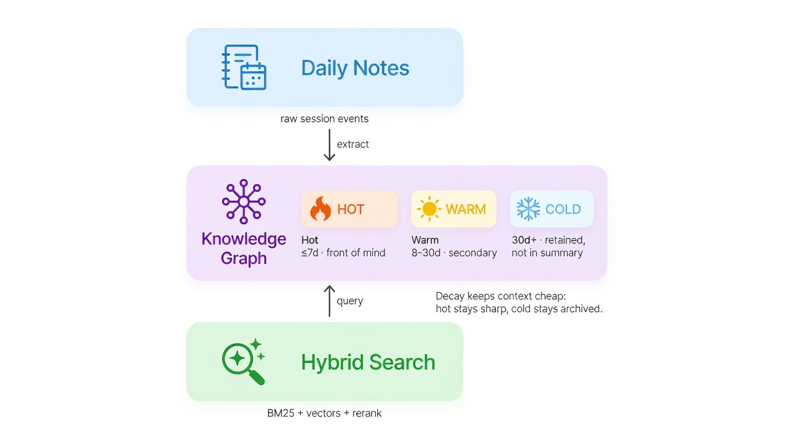
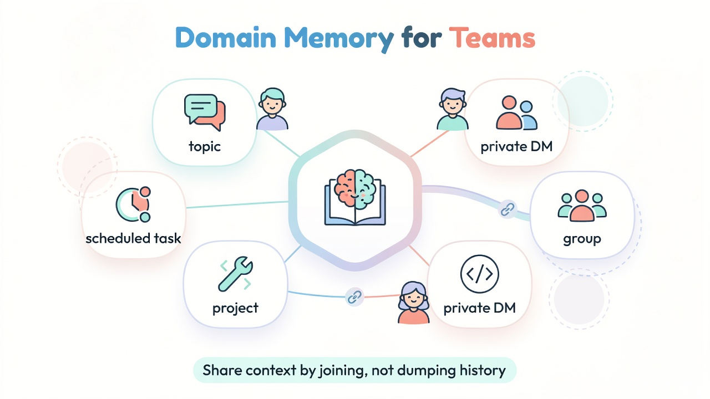
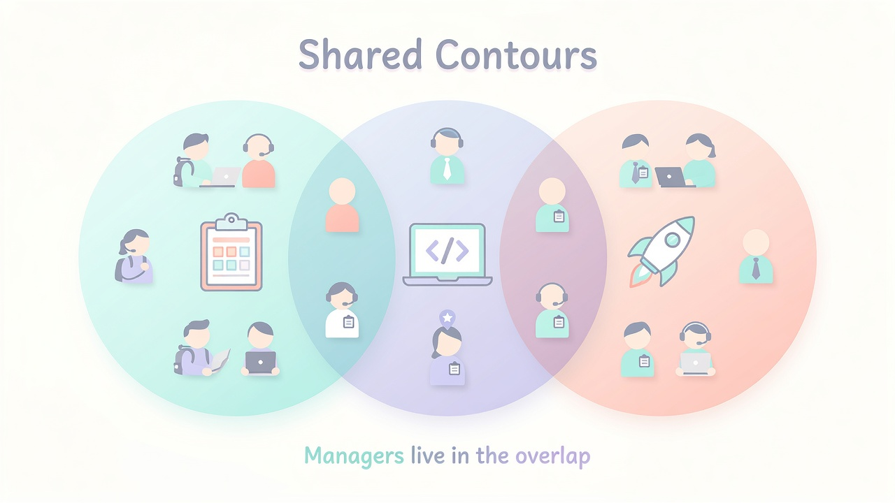

# Engram

**[Русский](README.md)** · **[English](README.en.md)**

**Память, которая остаётся острой, пока агенты и команды масштабируются.**

[OpenClaw](https://github.com/openclaw/openclaw)-скилл, который даёт долгоживущим агентам настоящую систему памяти:

- Knowledge Graph с confidence, decay и цепочками supersede
- Гибридный поиск (BM25 + embeddings + rerank)
- Самообслуживающийся heartbeat
- Domain-контуры для проектов, чатов и команд

**MIT · OpenClaw · v3.5 · в проде с v1**



*Три слоя + температура фактов: Daily Notes → Knowledge Graph (Hot / Warm / Cold) → Hybrid Search. Heartbeat держит систему в форме.*

---

## Проблема

Stateless-агенты забывают на каждом `/new` и compaction.

Сваливать историю чата в промпт не масштабируется — токены растут с днями, сигнал тонет в шуме.

**Engram держит рабочий контекст дешёвым, а историю — полной.**

Стоимость токенов на сессию остаётся примерно плоской. Качество памяти не разваливается со временем.

| Проблема | Без Engram | С Engram |
|---------|------------|----------|
| Агент забывает на `/new` или compaction | Стартует с нуля | Hybrid query восстанавливает рабочий контекст |
| Загрузка истории не масштабируется | O(days) навсегда | O(1) — ранжирование по recency + confidence |
| Субагенты стартуют «холодными» | Нет проектного контекста | Domain-контур при spawn |
| Память превращается в шум | Свалка или агрессивная чистка | Hot / Warm / Cold + supersede — ничего не удаляется, всё ранжируется |

---

## Что это даёт

| Возможность | Зачем это важно |
|---|---|
| **Долгоживущий личный агент** | Предпочтения, решения, коррекции — без набивания промпта |
| **Проектные субагенты с непрерывностью** | Эфемерные воркеры получают domain-контур: стартуют в курсе, оставляют status |
| **Командная / forum-память** | Каждый топик, DM или группа — изолированный контур; bleed по умолчанию нет |
| **Ролевой shared-контекст** | Менеджеры входят в overlaps и видят выбранные коллекции — не всю личную память |
| **Самоулучшающиеся ops** | Heartbeat + OLL замечают friction и предлагают фиксы |
| **Переносимый runtime** | Пути, запуск JS-инструментов и durable state учитывают различия POSIX и Windows |
| **Аудит дрейфа workspace** | `watchdog.js` проверяет схему, QMD, registry и heartbeat-state без правок |

---

## Ментальная модель

Три системы. Один скилл.

```
MEMORY     daily notes → KG facts → QMD hybrid search
HEARTBEAT  10-фазный cron: extract, synthesize, validate, OLL
DOMAINS    устойчивые контуры для субагентов и чат-сессий
```

**Изоляция сессий enforced в скриптах, а не «по договорённости».**

Main-сессия, проектные домены и chat-контуры не смешиваются молча.

---

## Качество памяти во времени

Факты живут в Knowledge Graph с температурой:

| Tier | Свежесть | В summary | В поиске |
|------|----------|-----------|----------|
| **Hot** | ≤7 дней | Да, заметно | Да |
| **Warm** | 8–30 дней | Да, ниже приоритет | Да |
| **Cold** | 30+ дней | Нет (принципы сохраняются) | Да через QMD |

Факты **никогда не удаляются**. Старые **supersede**'ятся и линкуются к заменам.

Retrieval — гибридный:

- BM25 для точных ключевых слов
- embeddings для семантического матча
- reranker для релевантности

Локальный GPU или Jina cloud — выбираете trade-off privacy/cost.

---

## Domain-память для команд

Субагенты эфемерны. Домены дают им — и людям — устойчивые memory-контуры.



Шесть типов доменов, один протокол:

| Type | Binding | Типичная роль |
|------|---------|---------------|
| `topic-thread` | Forum topic | Проектный канал с курируемой памятью |
| `peer-direct` | DM | Приватный 1:1 контур агента |
| `group-direct` | Group | Общий group-контур |
| `dev-project` | KG entity | Инженерная работа + spawnable-субагенты |
| `cron-task` | Schedule | Фоновые воркеры с durable state |
| `meta-domain` | Vertical access | Менеджерский контур: выбранные QMD-коллекции нижележащих workspace |

У каждого домена одна и та же форма:

| Файл | Кто пишет | Роль |
|------|-----------|------|
| `decisions.md` | owners | ЧТО разрешено |
| `workflow.md` | owners | КАК делается работа |
| `status.md` | workers | текущее состояние |
| `changelog.md` | workers | append-only история + proposals |

---

## Shared-контуры (командная история)

Engram моделирует командную память как **пересекающиеся project-контуры**.



Читайте диаграмму как org design, а не как dump чата:

- **Внутри одного контура, без overlap** → исполнители / individual contributors
- **В overlap** → менеджеры / координаторы, которые связывают проекты
- **Shared context** живёт на стыках, а не в глобальном пуле «все видят всё»

### Вертикальный доступ (role-scoped collections)

Менеджеры не получают «всю память сотрудников».

Они получают **выбранные коллекции**, нужные для координации:

- status / decisions / changelogs проектных доменов
- scoped work notes, привязанные к проекту
- опциональные opt-in коллекции для handoff

Приватные agent-контуры и личный контекст остаются приватными, пока явно не joined.

> Engram моделирует командную память как overlapping project-контуры: изоляция по умолчанию, shared context только на стыках.

---

## Heartbeat

Один cron-entrypoint раз в 30 минут.

Механика — inline. Суждения — изолированные субагенты.

| Phase | Что | Где |
|------:|-----|-----|
| 0 | Init: lock, state | inline |
| 0.5 | Ротация разросшихся daily notes | inline |
| 1 | Extract фактов из новых notes | `hb-extract` subagent |
| 1.5 | Summarize rotated archives | inline |
| 2 | Legacy-only weekly synthesis (после cutover выключен) | `hb-synthesis` subagent |
| 3 | Domain status check | `hb-domains` subagent |
| 3.5 | Apply pending changelogs | `hb-domains-write` subagent |
| 4 | Validate KG, update QMD | inline |
| 5 | Legacy OLL triggers (после cutover выключены) | compatibility only |
| 5.5 | Legacy OLL spawn queue (после cutover выключена) | compatibility only |
| 6 | Report + unlock | inline |

Падение одной фазы не валит остальные. Модели настраиваются per workspace в `engram.json`. Пайплайн идемпотентен.

---

## Operational Learning Loop

Система наблюдает собственное поведение — corrections, preferences, friction,
surprises и patterns — и возвращает сигналы в управляемый контур адаптации.
До cutover работал legacy Phase 5 heartbeat. После cutover PR 3–6 используют
trusted capture, proposal-only handoff, deterministic applicator и durable
strict-FIFO nightly coordinator. PR 6 добавляет scoped active-rule resolver и
универсальную bootstrap-инъекцию с conflict/cap guards. Live observe-only
canary на `target`, active rollout и rollback drill пройдены. Fresh init теперь
создаёт OLL сразу с `nightly.enabled=true` и `adaptation.mode=active`; PR 7
tooling сохраняет dry-run plan, backup/release markers и staged rollback.

Durable OLL state хранит канонические `batchId` и `operationId` внутри JSON,
а для имён каталогов и файлов использует Windows-safe ключи без запрещённого
символа `:`. Существующие legacy-каталоги nightly batches на POSIX продолжают
читаться, поэтому обновление формата не требует постоянной migration-логики.

---

## Quick start

```bash
# Установить QMD (hybrid search engine)
bun skills/engram/scripts/install-qmd.js

# Поднять workspace-side memory/OLL contract + deterministic heartbeat cron.
# Init установит 11 hooks, перезапустит gateway и проверит OLL hook read-back.
# Fresh OLL создаётся сразу enabled/active; единый nightly scheduler остаётся внешним.
bun skills/engram/scripts/init.js --with-cron
```

Существующий workspace:

```bash
bun skills/engram/scripts/install-deterministic-heartbeat-cron.js \
  --workspace /path/to/workspace --agent-id main --schedule '*/30 * * * *'
```

Аудит дрейфа workspace без изменений:

```bash
bun skills/engram/scripts/watchdog.js --workspace /path/to/workspace --json
```

## Engram CLI для QMD

Engram включает read-only CLI поверх общего QMD core. Он разрешает workspace и физический SQLite-индекс, проверяет policy и запускает QMD через argv без shell interpolation.

```bash
# Запуск из checkout — глобальная установка не нужна
bun bin/engram --version
bun bin/engram --workspace /path/to/workspace qmd doctor --strict

# Controlled read: коллекции всегда задаются явно
bun bin/engram --workspace /path/to/workspace \
  qmd query "search text" -c workspace-memory -c life
```

Публичных `engram qmd update/embed` и generic passthrough нет. Внутренний
coordinator core хранит dirty generations по physical index, объединяет записи
и выполняет защищённую последовательность index-wide `update` → scoped
incremental `embed` без `-f`. Production call sites и topology остаются legacy
до отдельного rollout. Writer call sites уже поддерживают отключённый по
умолчанию shadow-режим `qmd.maintenance.mode: "shadow"`: он только фиксирует
dirty generations и не запускает дополнительный QMD maintenance. Контракт:
[`references/qmd-global-maintenance.md`](references/qmd-global-maintenance.md).

Перед shared migration декларативный registry проверяет уникальность
collection names/paths, единственного owner и направленность readable scope.
Технический `main` не может читать business collections. Read-only preflight:
[`references/qmd-global-registry.md`](references/qmd-global-registry.md).

Launcher устанавливается в `$BUN_INSTALL/bin` или `~/.bun/bin`. Installer не перезаписывает и не удаляет чужие файлы.

```bash
bun scripts/install-cli.js --dry-run
bun scripts/install-cli.js
engram --version
```

Команды, JSON protocol, exit codes и trust model описаны в [`references/qmd-cli.md`](references/qmd-cli.md). Пошаговый production rollout и rollback — в [`references/qmd-cli-rollout.md`](references/qmd-cli-rollout.md).

## Requirements

- [OpenClaw](https://github.com/openclaw/openclaw) — runtime агента
- [Bun](https://bun.sh) — runtime скриптов
- QMD — ставится bootstrap'ом; вариант `local` (GPU/CPU) или `jina` (cloud)

Runtime paths используют platform-native семантику: `fileURLToPath()` для
модульных путей, junction для workspace-ссылки на Windows и directory `fsync`
только там, где он поддерживается. Cross-platform инварианты проверяются
тестами; основной production-контур проекта по-прежнему работает на Linux.

## Documentation

| Тема | Файл |
|------|------|
| Протокол скилла (канон) | [`SKILL.md`](./SKILL.md) |
| Полная спека heartbeat | `references/HEARTBEAT.md` |
| Flow heartbeat + cron | `references/heartbeat-flow.md` |
| Справочник скриптов | `references/scripts.md` |
| Workspace watchdog | `references/watchdog.md` |
| Meta-domain | `references/meta-domain.md` |
| OLL | `references/oll.md` |
| OLL nightly adaptation — implemented runtime, clean-install contract, canary evidence and gated rollout | `references/oll-nightly-adaptation.md` |
| OLL memory candidate compiler — bounded multi-source evidence, optimistic active-rule promotion, numbered notification/rollback | `references/oll-memory-candidates.md` |
| Hooks | `references/hooks.md` |
| Домены субагентов | `references/subagent-memory.md` |
| Telegram topic-thread | `references/topic-thread.md` |
| Схема факта | `references/fact-schema.md` |
| Memory decay | `references/decay-rules.md` |
| Архитектура | `references/architecture.md` |
| Setup | `references/setup.md` |
| QMD setup | `references/qmd-setup.md` |
| Engram QMD CLI | `references/qmd-cli.md` |
| CLI rollout и rollback | `references/qmd-cli-rollout.md` |

## License

MIT
