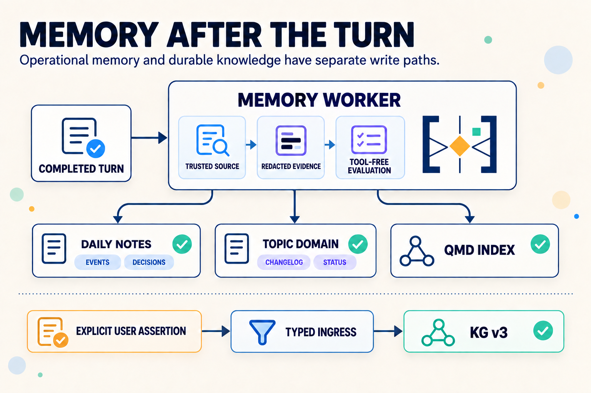
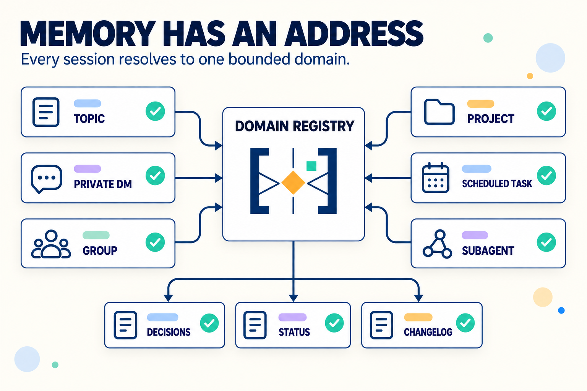
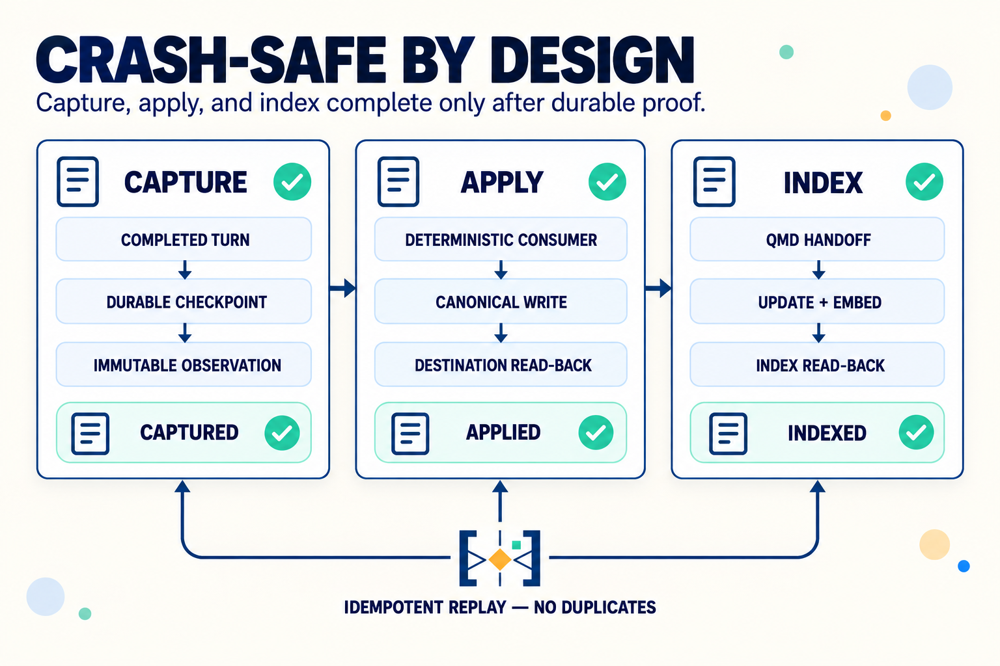

# Engram

**[English](README.md)** · **[Русский](README.ru.md)**

**Durable memory for long-lived agents — captured after the turn, isolated by scope, and backed by receipts.**

Engram is an [OpenClaw](https://github.com/openclaw/openclaw) memory system for personal agents, project chats, and agent teams. Its current architecture is built around **Memory Worker**: a post-turn pipeline that turns completed conversations into compact operational memory without asking the foreground agent to remember to write it down.

- automatic episodic capture for Events and Decisions;
- exact workspace/session isolation;
- crash-safe queues, immutable observations, and read-back receipts;
- Knowledge Graph v3 for explicit durable assertions;
- hybrid retrieval through QMD (BM25 + embeddings + rerank);
- domain memory for projects, topics, groups, and subagents.

**MIT · OpenClaw · v3.6.5**

---

## Why Engram exists

Agents lose continuity on `/new`, after compaction, and across ephemeral workers. Loading full chat history postpones the problem: token cost grows, signal quality falls, and private contexts become hard to separate.

Engram keeps the active prompt small while preserving a searchable, scoped history.

| Problem | Without Engram | With Engram |
|---|---|---|
| A new session starts cold | Re-read or paste old chats | Retrieve compact daily/domain memory |
| The agent forgets to record a result | Important context disappears | Memory Worker evaluates completed turns |
| Memory becomes a text dump | Low precision and growing token cost | Typed capture, receipts, and hybrid search |
| Project contexts bleed together | Accidental cross-project recall | Exact session and collection boundaries |
| Background processing partially fails | Silent gaps or duplicates | Durable queues, idempotent effects, explicit health |

---

## The current architecture

Engram separates **operational memory**, **durable knowledge**, and **retrieval**. They are connected, but they do not share write authority.



The important boundary is intentional:

- **Memory Worker records what happened.** It owns operational Events and Decisions only for explicitly activated scopes.
- **KG v3 records what must remain a durable current assertion.** It accepts only explicit, authorized typed writes from the source turn.
- **QMD is a derived retrieval layer.** It indexes canonical memory but never becomes the source of truth.
- **Heartbeat maintains the workspace.** After the KG v3 cutover it no longer classifies daily notes or promotes them into the graph.

Automatic observation-to-KG promotion is retired. A model noticing something in a conversation is not enough to mutate durable knowledge.

---

## Memory Worker

Memory Worker is the default capture path for activated personal and project contours.

### 1. Capture the completed turn

The OpenClaw integration correlates trusted message, persisted-turn, run, and completion identities. It commits a checkpoint before evaluation, stores only bounded evidence, redacts credentials, and rejects raw tool outcomes, media, and attachments.

The crash guarantee begins once the first checkpoint is durably written. A host failure before hook invocation remains outside the Engram boundary and is never silently described as recovered.

### 2. Evaluate the episode

The worker uses a sealed, tool-free evaluator. It produces a bounded set of compact `events` or `decisions` assertions plus an explicit disposition for every admitted source: `asserted`, `supports`, `duplicate`, `skip`, or `unresolved`.

The contextual v2 evaluator can join a bounded local episode, distinguish actors, and preserve status such as `requested`, `decided`, `reported_done`, `accepted`, or `failed`. Exact source spans remain attached to the observation; confidence cannot override scope or authority checks.

### 3. Apply with proof

A separate deterministic consumer writes the admitted entry to the correct daily note. Every write has:

- an opaque Markdown anchor;
- an immutable apply receipt;
- exact source, scope, producer, and policy provenance;
- destination read-back before completion;
- idempotent crash recovery.

For topic workspaces, a second receipt-joined consumer projects verified entries into the domain changelog and recent status. It does not re-run a model or invent a second source of truth.

### 4. Hand off to retrieval

After the canonical write, Engram emits a content-free QMD dirty-generation handoff. The global coordinator performs `update` and incremental `embed`, then seals `canonical_indexed` only after exact collection, document, anchor, digest, and physical-index read-back.

Retrieval and utilization receipts are deliberately not claimed without host-owned evidence. Engram distinguishes **captured**, **applied**, **indexed**, **retrieved**, and **used** instead of collapsing them into one optimistic “success”.

### Ownership is explicit

Memory Worker activates through a digest-pinned rollout projection. Until the projection is valid, enabled, in scope, and past its activation boundary, foreground capture remains authoritative. Once ownership transfers, foreground Events/Decisions writes are rejected to prevent duplicates.

The same rule applies to a bounded agent family: every admitted source and write still retains its exact runtime-session scope.

---

## Knowledge Graph v3

KG v3 is the durable assertion layer, not a summary of everything the worker observed.

- Writes use `engram_memory_save` or `engram_memory_retract` inside an authorized source turn.
- Entity and predicate registries fail closed.
- One source turn may perform at most one typed mutation.
- Assertions are append-only and provenance-bound.
- Corrections create an explicit replacement/supersession chain; historical records are preserved.
- The legacy v2 `items.json` store is immutable and has no fallback writer.

Actual use can be recorded separately through `engram_memory_access`. A daily coordinator reconciles those events into an access-state overlay and rebuilds the decay-aware `life/v3/current-summary.md` projection without mutating canonical assertion bodies.

| Tier | Recency | Current summary | Searchable |
|---|---:|---|---|
| **Hot** | ≤ 7 days | prominent | yes |
| **Warm** | 8–30 days | lower priority | yes |
| **Cold** | 30+ days | omitted | yes through QMD |

---

## Domains and team memory

Domains give ephemeral workers and long-running chats a persistent, bounded context.



| Domain type | Binding | Typical use |
|---|---|---|
| `topic-thread` | forum topic | project channel with curated memory |
| `peer-direct` | DM | private 1:1 contour |
| `group-direct` | group | shared group contour |
| `dev-project` | KG entity | engineering work and spawned subagents |
| `cron-task` | schedule | background workers with durable state |

Topic domains keep `decisions.md`, `status.md`, and `changelog.md`. Domain context is injected at bootstrap; it is not copied into every prompt or exposed to sibling projects.

For an already enrolled project workspace, creating a topic domain is one resumable operation: registry entry, host route, exact QMD collections, and Memory Worker binding are verified together.

---

## Reliability and safety properties



Engram treats memory as a sequence of verifiable transitions, not one optimistic background task. A completed turn becomes recoverable after its durable checkpoint; canonical application and indexing complete only after their own receipt and exact read-back.

| Property | How Engram enforces it |
|---|---|
| **No duplicate capture** | explicit ownership transfer + idempotent operation identities |
| **No cross-scope fallback** | exact workspace/session bindings and exact QMD collection resolution |
| **Crash recovery** | durable checkpoints, queues, leases, immutable receipts, destination read-back |
| **Bounded evidence** | redaction, size limits, TTLs, and no raw tool/media ingestion |
| **No silent KG promotion** | separate typed KG v3 authority; observer has no KG mutation capability |
| **Partial-failure visibility** | per-workspace accounting and fleet health; cron `ok` is not treated as semantic success |
| **Safe rollback** | projections can be disabled while queues, receipts, and canonical data remain intact |

Retention is bounded by artifact class: raw evidence is short-lived; content-free provenance and receipts live longer so applied memory can still be audited after evidence expires.

---

## Supporting services

### QMD

QMD provides scoped hybrid search:

- BM25 for exact terms;
- embeddings for semantic similarity;
- reranking for final relevance;
- one coordinated physical index across many logical collections.

Every agent-facing search requires at least one explicit `-c <collection>`. Collection ownership and readable scope are validated before execution.

```bash
bun bin/engram --workspace /path/to/workspace \
  qmd query "search text" -c workspace-memory -c workspace-life
```

Public `engram qmd update/embed` and generic passthrough are intentionally absent. Index maintenance belongs to the coordinator.

### Heartbeat

Heartbeat is now a deterministic maintenance runner. It handles locks, daily-note rotation and watermarks, domain maintenance, validation, and reporting. KG extraction and automatic promotion are retired; QMD maintenance may be delegated to the global coordinator.

### Operational Learning Loop

OLL observes authorized friction, correction, preference, workflow, and quality signals. A separate nightly coordinator performs reconciliation and bounded adaptation. Rules are scoped, receipt-backed, rollback-capable, and injected only when an active projection matches the current context.

Memory-derived rule materialization is a separate gated surface; ordinary Memory Worker output does not automatically become an instruction.

---

## Quick start

Requirements:

- [OpenClaw](https://github.com/openclaw/openclaw);
- [Bun](https://bun.sh) ≥ 1.3 and < 2;
- QMD in local or cloud-backed mode.

Initialize a workspace:

```bash
# Install the hybrid-search engine
bun skills/engram/scripts/install-qmd.js

# Preview first
bun skills/engram/scripts/init.js \
  --workspace /path/to/workspace \
  --agent-id main \
  --qmd-variant auto \
  --with-cron \
  --dry-run

# Apply after review
bun skills/engram/scripts/init.js \
  --workspace /path/to/workspace \
  --agent-id main \
  --qmd-variant auto \
  --with-cron
```

The init command creates the workspace memory structure, installs the managed hook set, restarts the gateway when required, validates hook read-back, and can provision a disabled-first maintenance cron.

**Memory Worker activation is intentionally separate.** Init does not invent fleet membership, source scopes, model authority, QMD bindings, or an operator-approved activation boundary. Use the reviewed rollout tooling and deployment runbook for your environment, then verify the installed plugin digest, projection, scheduler, canonical receipt/read-back, and a real scoped QMD retrieval.

Audit a workspace without applying fixes:

```bash
bun skills/engram/scripts/watchdog.js \
  --workspace /path/to/workspace \
  --json
```

Do not treat scaffolding, an empty worker pass, or scheduler `ok` as end-to-end proof.

---

## Documentation

| Topic | Document |
|---|---|
| Canonical agent protocol | [`SKILL.md`](SKILL.md) |
| Memory Worker implementation and guarantees | [`src/memory-observation/README.md`](src/memory-observation/README.md) |
| Contextual Memory Worker v2 | [`contracts/memory-observation/v2/README.md`](contracts/memory-observation/v2/README.md) |
| Memory observation authority contracts | [`contracts/memory-observation/v1/README.md`](contracts/memory-observation/v1/README.md) |
| Architecture | [`references/architecture.md`](references/architecture.md) |
| Setup | [`references/setup.md`](references/setup.md) |
| Workspace watchdog | [`references/watchdog.md`](references/watchdog.md) |
| QMD coordinator | [`references/qmd-global-maintenance.md`](references/qmd-global-maintenance.md) |
| Topic domains | [`references/topic-thread.md`](references/topic-thread.md) |
| Domain/subagent memory | [`references/subagent-memory.md`](references/subagent-memory.md) |
| KG v3 decay and current projection | [`references/decay-rules.md`](references/decay-rules.md) |
| OLL | [`references/oll.md`](references/oll.md) |
| Changelog | [`CHANGELOG.md`](CHANGELOG.md) |

## License

[MIT](LICENSE)
